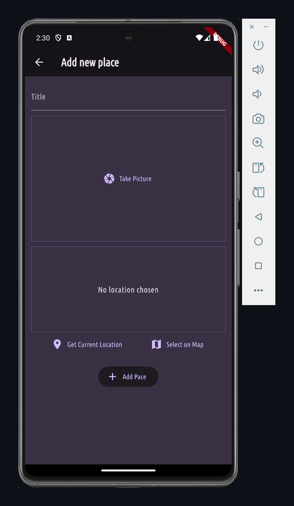
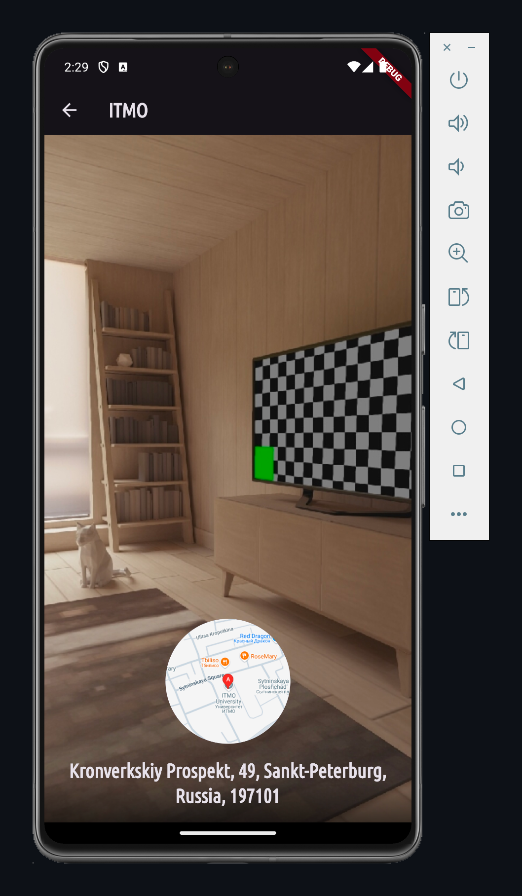

# Favorite Places Flutter App

Favorite Places Flutter App — мобильное приложение позволяющее пользователям добавлять, просматривать и управлять интересными местами. Оно поддерживает загрузку изображений, определение местоположения и отображение точек на карте. Для управления состоянием используется Provider, а для работы с картами применяется Google Maps API.

## Технологии

- **Provider:** Управление состоянием приложения.
- **Google Maps API:** Отображение мест на карте и определение местоположения.
- **Image Picker:** Загрузка изображений пользователей.

